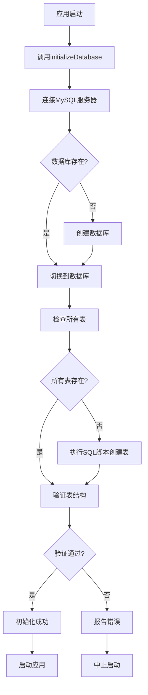

# 数据库自检与初始化功能 - 技术说明

## 📌 功能概述

本文档详细说明了为"数字孪生地铁灾害应急仿真"项目实现的**数据库自检与初始化**功能的技术细节。

## 🎯 设计目标

1. **自动化** - 减少手动操作，降低部署复杂度
2. **幂等性** - 可重复执行，不产生副作用
3. **安全性** - 不破坏现有数据
4. **可观察** - 提供详细的执行日志
5. **容错性** - 完善的错误处理和恢复机制

## 🏗️ 架构设计

### 模块分层

```
┌─────────────────────────────────────────┐
│         Application Layer               │
│  (server.js, scripts)                   │
└─────────────┬───────────────────────────┘
              │
              ▼
┌─────────────────────────────────────────┐
│      Database Initializer Layer         │
│  (dbInitializer.js)                     │
│  - initializeDatabase()                 │
│  - checkConnection()                    │
│  - checkDatabaseExists()                │
│  - checkTableExists()                   │
│  - createDatabase()                     │
│  - createTables()                       │
│  - validateTableStructure()             │
└─────────────┬───────────────────────────┘
              │
              ▼
┌─────────────────────────────────────────┐
│         Database Layer                  │
│  (mysql2/promise)                       │
└─────────────────────────────────────────┘
```

### 执行流程



## 🔧 核心组件详解

### 1. initializeDatabase()

**功能**: 完整的数据库初始化流程

**实现原理**:
1. 创建不指定数据库的连接（用于检查和创建数据库）
2. 查询 `information_schema.SCHEMATA` 检查数据库
3. 如不存在，执行 `CREATE DATABASE`
4. 切换到目标数据库
5. 查询 `information_schema.TABLES` 检查表
6. 如有缺失，读取并执行SQL脚本
7. 查询 `information_schema.COLUMNS` 验证表结构

**关键代码**:
```javascript
async function initializeDatabase(options = {}) {
  const config = { ...DB_CONFIG, ...options };
  const dbName = config.database;
  
  // 不指定数据库的配置
  const connectionConfigWithoutDB = { ...config };
  delete connectionConfigWithoutDB.database;
  
  let connection = await mysql.createConnection(connectionConfigWithoutDB);
  
  // 检查数据库
  const dbExists = await checkDatabaseExists(connection, dbName);
  if (!dbExists) {
    await createDatabase(connection, dbName);
  }
  
  // 切换数据库
  await connection.query(`USE \`${dbName}\``);
  
  // 检查和创建表
  const { missingTables } = await checkAllTables(connection, dbName);
  if (missingTables.length > 0) {
    await createTables(connection);
  }
  
  // 验证表结构
  await validateTableStructure(connection, dbName);
  
  return result;
}
```

### 2. checkDatabaseExists()

**功能**: 检查数据库是否存在

**实现原理**:
查询 MySQL 的系统表 `information_schema.SCHEMATA`

```javascript
async function checkDatabaseExists(connection, dbName) {
  const [rows] = await connection.query(
    'SELECT SCHEMA_NAME FROM information_schema.SCHEMATA WHERE SCHEMA_NAME = ?',
    [dbName]
  );
  return rows.length > 0;
}
```

### 3. checkTableExists()

**功能**: 检查单个表是否存在

**实现原理**:
查询 MySQL 的系统表 `information_schema.TABLES`

```javascript
async function checkTableExists(connection, dbName, tableName) {
  const [rows] = await connection.query(
    'SELECT TABLE_NAME FROM information_schema.TABLES ' +
    'WHERE TABLE_SCHEMA = ? AND TABLE_NAME = ?',
    [dbName, tableName]
  );
  return rows.length > 0;
}
```

### 4. validateTableStructure()

**功能**: 验证表结构完整性

**实现原理**:
查询 `information_schema.COLUMNS` 检查每个表的关键字段

```javascript
async function validateTableStructure(connection, dbName) {
  const tableStructures = {
    simulations: ['sim_id', 'scenario_id', 'map_level', ...],
    simulation_frames: ['sim_id', 'frame_index', ...],
    // ...
  };
  
  for (const [tableName, expectedColumns] of Object.entries(tableStructures)) {
    const [columns] = await connection.query(
      'SELECT COLUMN_NAME FROM information_schema.COLUMNS ' +
      'WHERE TABLE_SCHEMA = ? AND TABLE_NAME = ?',
      [dbName, tableName]
    );
    
    const actualColumns = columns.map(row => row.COLUMN_NAME);
    const missingColumns = expectedColumns.filter(
      col => !actualColumns.includes(col)
    );
    
    if (missingColumns.length > 0) {
      return false;
    }
  }
  
  return true;
}
```

### 5. createTables()

**功能**: 执行SQL脚本创建表

**实现原理**:
读取 `module1_schema.sql` 文件并执行

```javascript
async function createTables(connection) {
  const schemaFilePath = path.join(__dirname, '../../db/sql/module1_schema.sql');
  const sqlContent = await fs.readFile(schemaFilePath, 'utf8');
  await connection.query(sqlContent);
}
```

## 🔐 安全性设计

### 1. 只读检查
- 所有检查操作都是只读的（SELECT查询）
- 不修改已存在的数据库和表

### 2. 幂等性保证
- 使用 `CREATE DATABASE IF NOT EXISTS`
- 使用 `CREATE TABLE IF NOT EXISTS`
- 重复执行不会产生错误

### 3. 事务安全
- 表创建在单个SQL脚本中执行
- 失败时整体回滚

### 4. 权限检查
- 连接失败时提供清晰的错误信息
- 不暴露敏感信息

## 📊 性能考虑

### 1. 连接管理
- 使用单一连接完成所有检查和创建操作
- 操作完成后立即关闭连接
- 避免连接泄漏

### 2. 查询优化
- 使用系统表索引（SCHEMA_NAME, TABLE_NAME）
- 最小化查询次数

### 3. 启动时间影响
- 数据库已存在且表完整时: < 100ms
- 创建数据库和表时: < 500ms
- 对应用启动影响最小

## 🧪 测试策略

### 单元测试
```javascript
// 测试连接
test('checkConnection should return true for valid config')

// 测试数据库检查
test('checkDatabaseExists should return false for non-existent db')

// 测试表检查
test('checkTableExists should return correct result')

// 测试完整流程
test('initializeDatabase should succeed')

// 测试幂等性
test('running initializeDatabase twice should succeed')
```

### 集成测试
- 在干净的MySQL实例上测试完整初始化
- 测试已存在数据库的情况
- 测试部分表缺失的情况

## 🚨 错误处理

### 错误分类

| 错误类型 | 错误码 | 处理策略 |
|---------|--------|---------|
| 连接失败 | ECONNREFUSED | 提示检查MySQL服务 |
| 认证失败 | ER_ACCESS_DENIED_ERROR | 提示检查用户名密码 |
| 权限不足 | ER_DBACCESS_DENIED_ERROR | 提示授予权限 |
| 文件不存在 | ENOENT | 提示检查SQL文件 |
| SQL语法错误 | ER_PARSE_ERROR | 记录详细错误并中止 |

### 错误恢复
```javascript
try {
  await initializeDatabase();
} catch (error) {
  if (error.code === 'ECONNREFUSED') {
    // 重试逻辑
  } else if (error.code === 'ER_ACCESS_DENIED_ERROR') {
    // 提示检查配置
  } else {
    // 其他错误处理
  }
}
```

## 📝 日志设计

### 日志级别
- `INFO`: 正常流程步骤
- `WARN`: 非致命问题（如表已存在）
- `ERROR`: 错误信息

### 日志格式
```
[DBInitializer] <Level> <Message>
```

### 关键日志点
1. 连接建立
2. 数据库检查结果
3. 数据库创建操作
4. 表检查结果
5. 表创建操作
6. 验证结果
7. 最终状态

## 🔄 未来扩展

### 1. 数据库迁移
```javascript
async function migrate(fromVersion, toVersion) {
  // 执行版本迁移
}
```

### 2. 多数据库支持
```javascript
const adapters = {
  mysql: MySQLAdapter,
  postgres: PostgresAdapter,
  sqlite: SQLiteAdapter
};
```

### 3. 备份功能
```javascript
async function backupDatabase(dbName) {
  // 创建数据库备份
}
```

### 4. 健康检查
```javascript
async function healthCheck() {
  // 定期检查数据库状态
}
```

## 📚 参考资料

- [MySQL Information Schema](https://dev.mysql.com/doc/refman/8.0/en/information-schema.html)
- [mysql2 Documentation](https://github.com/sidorares/node-mysql2)
- [DataStruction.md](../../DataStruction.md) - 项目数据结构规范

## 💡 最佳实践

1. **配置外部化** - 使用环境变量而非硬编码
2. **日志详细** - 记录所有关键操作
3. **错误友好** - 提供可操作的错误提示
4. **幂等设计** - 所有操作可重复执行
5. **权限最小化** - 生产环境使用受限账号
6. **定期备份** - 重要数据定期备份

---

**文档版本**: 1.0  
**最后更新**: 2026-03-30  
**维护者**: 开发团队
